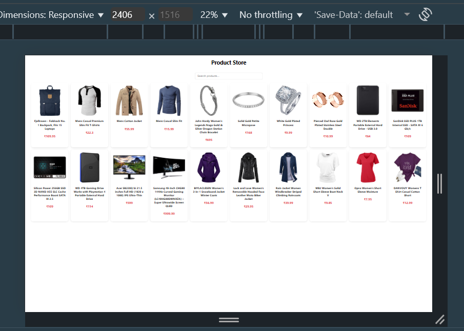
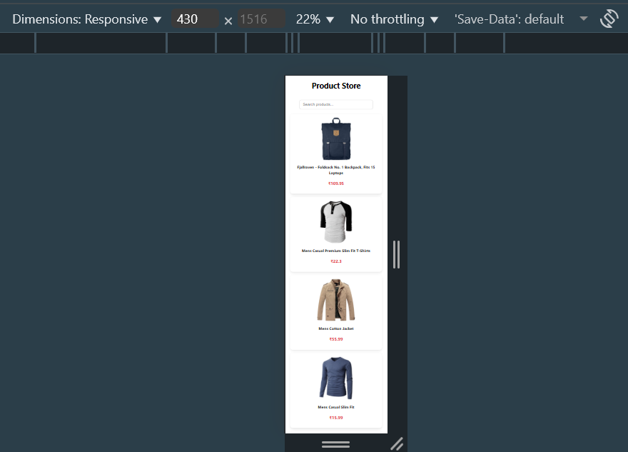

# Product Listing Page

## Project Overview

This is a React + Vite project that displays a product listing page using data from Fake Store API.

The project demonstrates:

- Fetching data using native fetch API (no Axios)
- Displaying product cards (image, title, price)
- Search bar to filter products by name
- Responsive design using Flexbox (works on desktop & mobile)

## Tech Stack

- React + Vite
- CSS (Flexbox for responsiveness)
- JavaScript Fetch API

## Project Structure

src/
│- components/
│ |- Products.jsx # Fetches data and renders product cards
│ |- Products.css # CSS for products page (search + layout)
│ |- ProductCard.jsx # Single product card component
│ |- ProductCard.css # CSS for product card
│
│- App.jsx # Main entry point
│- main.jsx # Vite entry
│
|- index.css # Global styles (minimal)

## How to Run Locally

### 1. Clone the repository:

git clone <url>
cd frontend

2. Install dependencies:
   npm install

3. Start development server:
   npm run dev
4. Open browser → http://localhost:5173

## Screenshots

### Desktop View

### Mobile View

# Features:

-Fetches products from Fake Store API using fetch()

-Product search by name

-Responsive layout with Flexbox

-Clean, modular code with reusable components
